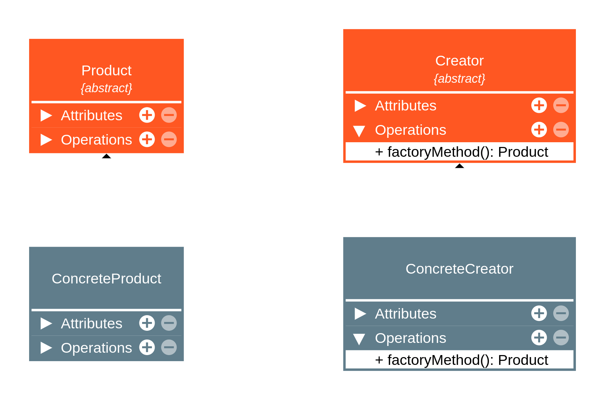

# Factory Method - Creational 

## Intenção
* Definir uma interface para criar um objeto, mas deixar as subclasses decidirem que classe instanciar. 

---

## Sobre:
- É um padrão de projeto criacional (lida com a criação de objetos)
- Oculta a lógica de instanciação do código cliente. O método fábrica será responsável por instanciar as classes desejadas. 
- É obtido através de herança. O **método fábrica** pode ser criado ou sobrescrito por subclasses.
- Dá flexibilidade ao código cliente permitindo a criação de novas factories sem a necessidade de alterar o código já escrito (Princípio open close). 
- Pode utilizar parâmetros para determinar o tipo dos objetos a serem criados ou os parâmetros a serem enviados aos objetos sendo criados. 

--- 

## Estrutura

- Factory Method tem 4 participantes principais na sua estrutura padrão
    1. **Product:**
        - **O que faz:** Define a interface comum para todos os objetos que o *factory method* cria. 
        - **Responsabilidade:** Garantir que todos os produtos concretos sigam o mesmo contrato, permitindo que o código cliente os utilize de forma polimórfica. 

    2. **ConcreteProduct:**
        - **O que faz:** É a implementação real e específica do produto. 
        - **Responsabilidade:** Implementar os métodos e a lógica de negócio definidos pela interface. 

    3. **Creator:**
        - **O que faz:** Declara o **Factory Method** abstrato ou com implementação padrão, o qual deve retornar um objeto do tipo ***Product***. 
        - **Responsabilidade:** Define o fluxo de negócio que depende dos produtos e delega a criação real do objeto para suas subclasses. Geralmente invoca o *factory method* dentro de sua própria lógica interna. 

    4. **ConcreteCreator:**
        - **O que faz:** Subclasse que herda de *Creator* e implementa (ou sobrepõe) o *factory method*. 
        - **Responsabiliade:** Instanciar e retrornar um *ConcreteProduct* específico. 

## Aplicabilidade
- Use o factory method quando não souber com certeza quais os tipos de objetos o código vai precisar. 
- Use para permitir a extensão das factories para criação de novos objetos. 
- Use para desacoplar o código que cria do código que usa as classes(Single Responsibility Principle).
- Use para dar um hook (gancho) às subclasses permitindo que elas decidam a lógica de criação de objetos; 
- Use para eliminiar a duplicação de código na criação de objetos. 

## Implementação - Teoria

**Observação importante:** Todos os objetos criados por um factory method tendem ser chamados de ***"Product"***(produto).

1. Criação de uma interface comum para todos os produtos(por exemplo, Product).
2. Criação de clases que implementam a interface dos produtos(por exemplo, ConcreteProduct1, ConcreteProduct2...).
3. Criação de uma classe (**Creator**) que implementa ou contém um **método fábrica**. Essa classe pode conter dados e outros métodos. São raros os casos onde a classe Creator é simplesmente uma interface com o factory method. O método fábrica é responsável por criar produtos que implementam a interface "Product". 
4. Criação de classes concretas que estendem a classe Creator e implementam o método fábrica. As classes ConcreteCreator podem retornar produtos diferentes, contando que esses produtos implementem a interface Product. 

## Consequências:

O que é bom ou ruim no Factory Method:

- **Bom:**
    - Ajuda na aplicação do **Open/Closed Principle**. O código estará aberto para extensão. 
    - Ajuda na aplicação do Single Responsibilitiy Principle. Separa o código que cria do código que usa o objeto. 
    - Ajuda no desacoplamento do seu código. 

- **Ruim:**
    - Pode causar uma explosão de subclasses. Será necessário uma classe Creator para cada ConcreteProdutct. Só é vantajoso quando já seria necessário estender a classe Creator na estrutura. 

    